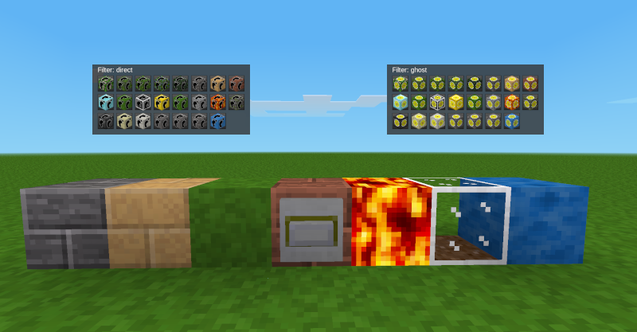

# Leaky Nodes

Der Mod »Leaky« (leaky) enthält Blöcke, die angelehnt sind an einige Standard-Nodes aus »minetest_game«. Man kann aber durch manche dieser Blöcke einfach hindurchgehen, andere per Mese-Schaltung temporär unsichtbar machen.  

Suche im Inventar nach »direct« für Blöcke, die man direkt durchschreiten kann (Inventar-Bild mit Fußabdruck) oder »ghost« für Blöcke, die sich mit Mese unsichtbar schalten lassen (Inventar-Bild mit gelbem Punkt). Für beide Varianten gibt es neben Stein-, Glas-, Blätter- und Grasblöcken auch Wasser- und Lavablöcke mit animierter Textur.  

Es gibt bisher keine Rezepte für die Blöcke. Daher sind sie nur mit »giveme« oder im Kreativ-Modus erreichbar. 

License:  
Author: This mod was made by Norbert Thien, multimediamobil – Region Süd (mmm-sued), 2024  
Code: The LGPLv3 applies to all code in this project.  
Media: The CC-BY-SA-3.0 license applies to textures and any other content in this project which is not source code.  
Notice: This mode uses code from the mod »mesecons« and textures from the mod »default« (»minetest_game«)
