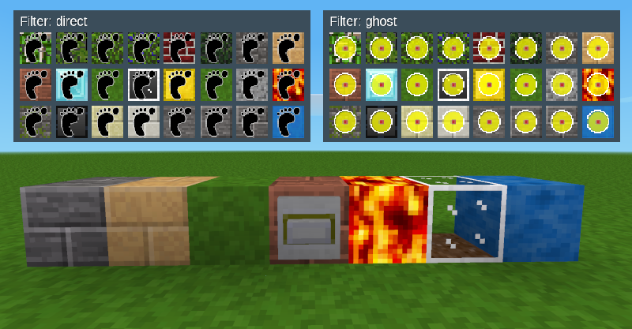

# Leaky Nodes

**DESCRIPTION:**
The mod »Leaky« (leaky) adds blocks to Minetest/Luanti with textures from the mod »default« (»minetest_game«). However, you can simply walk through some of these blocks and make others temporarily invisible with Mesecons circuits. In addition to stone, glass, leaf and grass blocks, there are also water and lava blocks with animated textures for both variants. The main purpose of »Leaky« is to build traps in escape games (or whatever makes sense to you).  

**USE:**
Search in the inventory for »direct« (inventory image with a footprint). Build a wall with the »direct« blocks and than walk through the stones without any resistance. Use the screwdriver if you want to turn the block into a floor plate. The ghoststones can be found in the inventory with »ghost« (inventory image with a yellow dot). These blocks can be made temporarily invisible using Mesecons circuits.  

**INSTALL:**
Unzip the downloaded folder and rename it to »leaky« (if necessary). Copy the folder into your »luanti/mods« folder.  

**DEPENDS:**
This mod requires »default« (part of »[minetest_game](https://content.luanti.org/packages/Minetest/minetest_game/)«) and »[mesecons](https://content.luanti.org/packages/Jeija/mesecons/)«. Optional dependency on »stairsplus« (part of »[moreblocks](https://content.luanti.org/packages/Calinou/moreblocks/)«). 

**KNOWN ISSUES:**
There are currently no recipes for the blocks. Therefore, they can only be accessed with »giveme« or in creative mode. Some »direct« blocks are laid out as thin slabs. Occasionally this results in incorrect light refractions. The textures for lava and water could look better, both pointable. Some sounds don't work properly.  

**LICENSE:**  
Author: This mod was made by [Norbert Thien, multimediamobil – Region Süd (mmmsued)](https://minetest-modding.weebly.com/), 2024  
Code: Except otherwise specified, all code in this project is licensed as LGPLv3.
Media: Except otherwise specified, all media and any other content in this project which is not source code is licensed as CC BY SA 3.0.   
Note: This mode uses concepts and code from the mod »mesecons« and textures from the mod »default« (»minetest_game«).
